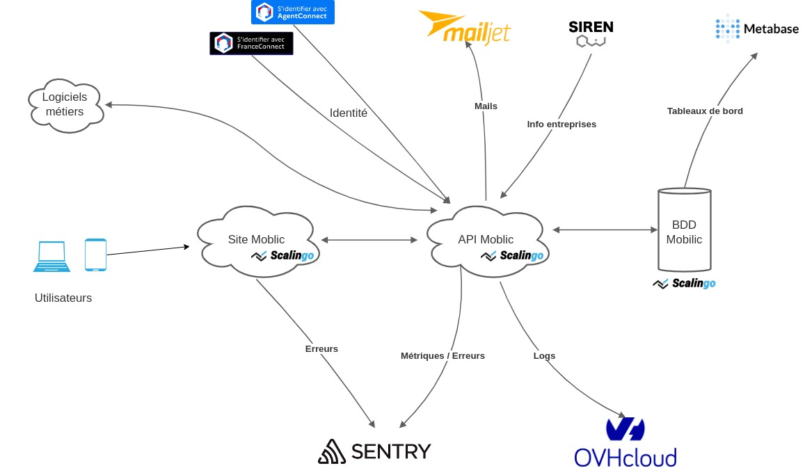

# Mobilic

**Simplifier le suivi du temps de travail dans le transport routier léger pour lutter contre le travail illégal**

</img>

Dépôt de code (partie front) de la startup d'état **Mobilic** incubée à la Fabrique Numérique du Ministère de la Transition Écologique.

Ce `README` s'adresse aux développeurs informatiques du projet. Pour plus d'infos en tant qu'utilisateur.ice du produit ou de l'API, vous pouvez consulter les liens suivants :

- [Site web](https://mobilic.beta.gouv.fr)
- [FAQ](https://faq.mobilic.beta.gouv.fr/)
- [Documentation technique de l'API](https://mobilic.beta.gouv.fr/developers)
- [Conditions d'interfaçage](https://developers.mobilic.beta.gouv.fr/conditions-dinterfacage)

## Architecture logicielle

Le projet est divisé en 2 grandes briques distinctes :

- le front (= le site web Mobilic)
  - Single Page App React.js servie par Nginx (statique)
  - le dépôt est organisé par outil
    - `web/pwa` : PWA de saisie des temps pour les salariés (sur mobile)
    - `web/admin` : dashboard de suivi pour les gestionnaires (sur Desktop)
    - `web/control` : divers services pour les corps de contrôle
    - `web/landing` : pages publiques
    - `web/home` : homepage d'un utilisateur

- le back (l'API Mobilic)
  - Application Flask servie par Gunicorn avec une API GraphQL
  - [lien vers le dépôt](https://github.com/MTES-MCT/mobilic-api)



## Infrastructure

Les serveurs du back et du front ainsi que la base de données sont hébergés chez [Scalingo](https://scalingo.com/).

## Environnements

- **dev** pour le développement en local
- **test** pour les tests
- **staging**: environnement de recette fonctionnelle, synchronisé avec la branche `master`.
- **prod**: environnement de production, synchronisé avec la branche `prod`
- **sandbox**: environnement miroir de la prod qui sert d'espace de test pour les utilisateurs de l'API et pour les contrôleurs. Synchronisé lui aussi avec la branche _prod_.

## Outillage

- [CircleCI](https://circleci.com/) pour l'intégration continue et le déploiement
- [Mailjet](https://fr.mailjet.com/) pour l'envoi de mails
- [Sentry](https://sentry.incubateur.net/) pour le reporting des erreurs
- [Graylog](https://www.graylog.org/) pour l'indexation des logs
- [Metabase](https://www.metabase.com/) pour l'analyse et la visualisation des données Mobilic
- [Matomo](https://fr.matomo.org/) pour l'analyse du traffic web
- [Updown](https://updown.io/) pour la page de statuts et les alertes

## Développement local

La partie suivante couvre uniquement le front. Pour le back il faut se rendre dans le [dépôt correspondant](https://github.com/MTES-MCT/mobilic-api).

### Pré-requis

- [Node](https://nodejs.org/en/) 24.x LTS
- [pnpm](https://pnpm.io/) 10.24.0 (installé automatiquement via [corepack](https://nodejs.org/api/corepack.html))
- Eventuellement [Nginx](https://fr.wikipedia.org/wiki/NGINX) pour reproduire à l'identique l'environnement de production. Facultatif pour le développement local.

### Installation

Activer corepack puis installer les dépendances (sur un shell UNIX) :

```sh
corepack enable
pnpm install
```

### Variables d'environnement

Une seule variable pertinente pour le développement local :

- `REACT_APP_API_HOST` qui précise l'URL du serveur du back (http://localhost:5000 le plus souvent)

### Démarrage du serveur de développement

Pour lancer le serveur de développement qui recompile à la volée :

```sh
REACT_APP_API_HOST=http://localhost:5000 pnpm start
```

Le serveur sera accessible à l'adresse http://localhost:3000.

### Créer une image de production

Pour créer une image de production :

```sh
REACT_APP_API_HOST=http://localhost:5000 pnpm build
```

Pour créer une image de production avec le playground GraphQL :

```sh
REACT_APP_BUILD_TARGET=playground REACT_APP_API_HOST=http://localhost:5000 pnpm build
```

Cela va générer un dossier `build` à la racine du projet, prêt à être servi par n'importe quel serveur statique. Par exemple avec un serveur statique Python, en exécutant la commande suivante depuis la racine du projet

```sh
cd build && python -m SimpleHTTPServer 3001
```

L'image de production sera alors servie à l'adresse http://localhost:3001.

L'intérêt d'utiliser une image de production plutôt que le serveur de développement est assez anecdotique :

- soit pour évaluer la performance du code
- soit pour tester le mode offline de la PWA (en effet le serveur de développement ne permet pas de configurer le service worker du navigateur).

### Tester dans des conditions identiques à la production

En production l'image générée par `pnpm build` est servie par un serveur nginx qui effectue en plus les choses suivantes :

- force le `https`
- ajoute les en-tête de réponse, notamment concernant la gestion de cache et la sécurité
- reverse proxy les requêtes à `/api` vers le serveur du back

Cette couche Nginx est ajoutée via un [buildpack Scalingo](https://doc.scalingo.com/platform/deployment/buildpacks/nginx), qui construit un ficher de config nginx valide à partir des [données suivantes](./servers.conf.erb).

En développement local il est possible d'ajouter cette couche Nginx (avec la même configuration sauf la partie https). La commande suivante permet de créer une image de production puis de la servir via un serveur Nginx :

```sh
REACT_APP_API_HOST=... pnpm build-with-nginx
```

Cette commande nécessite comme pré-requis :

- `nginx` en ligne de commande
- `erb`, la ligne de commande de Ruby pour remplir des templates

## Infos complémentaires

Le front a été initialisé avec la boîte à outils [Create React App](https://github.com/facebook/create-react-app).

Il utilise donc les technologies suivantes :

- [webapck](https://webpack.js.org/) pour fusionner (et minifier) les fichiers JS, CSS, image, ...
- [Sass](https://sass-lang.com/) pour simplifier l'écriture des styles
- [babel](https://babeljs.io/) pour transpiler le JS
- [workbox](https://developers.google.com/web/tools/workbox) pour générer un service worker (configurer le mode offline de la PWA)

### Structure du dépôt

- `config` qui contient les fichiers de config générés par create-react-app et notamment le fichier de config Webpack.
- `common` qui contient surtout le JS fonctionnel (peu de JSX ou de composants React) et des fichiers image.
- `public` qui contient les fichiers servis statiquement (html, images, ...)
- `scripts` qui contient les scripts create-react-app, notamment `start`et `build`
- `web` qui contient le JS des différents outils (PWA, dashboard, contrôle, landing, ...)

## Licence

[Licence MIT](./LICENSE.txt)
