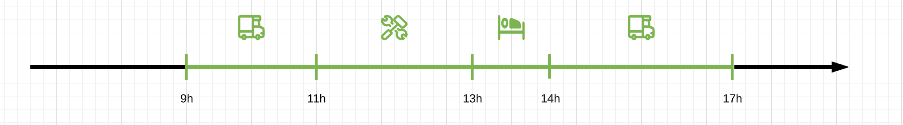
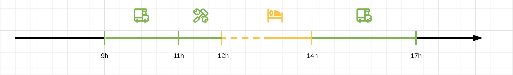
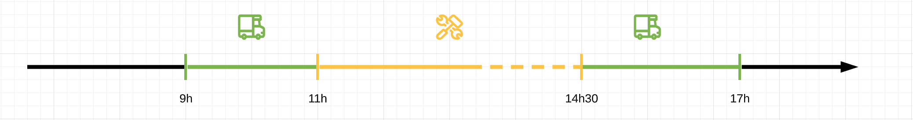
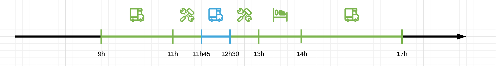
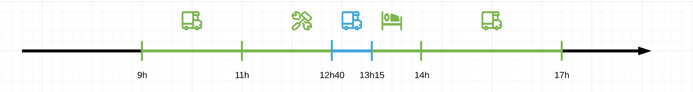
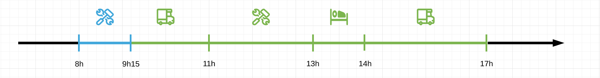
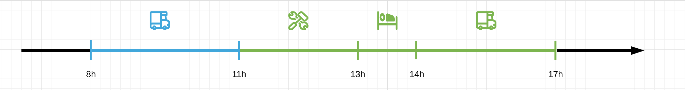
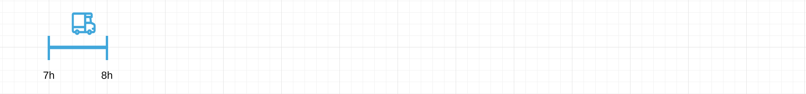

## Usages et opérations de l'enregistrement en différé

Bien que l'API Mobilic privilégie une saisie en temps réel du temps de travail elle laisse aussi la place à un second mode d'enregistrement : en différé. Ce mode couvre deux usages :

- l'enregistrement de nouvelles activités en différé
- la correction d'activités précédemment enregistrées

> Comme pour l'enregistrement en temps réel :
>
> - les opérations nécessitent d'être authentifié
> - doivent être rattachées à une mission

### Enregistrement de nouvelles activités

L'opération pour enregistrer une activité en différé est la suivante. Contrairement à l'enregistrement en temps réel il faut préciser une heure de fin.

```gql
mutation {
    activities {
        logActivity(type: InputableActivityTypeEnum!, startTime: TimeStamp!, missionId: Int!, endTime: TimeStamp!) {
            output {
                id
                type
                startTime
            }
            nonBlockingErrors
        }
    }
}
```

- `type`, la nature de l'activité (déplacement, travail, accompagnement, pause)
- `startTime`, l'heure de début de l'activité
- `missionId`, la mission de laquelle fait partie l'activité
- `endTime`, l'heure de fin de l'activité

### Correction d'activités

La correction d'activités consiste à modifier les informations d'une activité existante. Trois modifications sont possibles :

- supprimer l'activité
- modifier l'heure de début
- modifier l'heure de fin

```gql
mutation {
    activities {
        editActivity(activityId: Int!, dismiss: Boolean!, startTime: TimeStamp, endTime: TimeStamp) {
            output {
                id
                type
                startTime
            }
            nonBlockingErrors
        }
    }
}
```

Les arguments sont les suivants :

- `activityId` : identifiant de l'activité à modifier
- `dismiss` : flag qui indique si la modification est une suppression (`true`) ou une édition (`false`)
- `startTime` : optionnelle, la nouvelle heure de début de l'activité dans le cas d'une édition
- `endTime` : optionnelle, la nouvelle heure de fin de l'activité dans le cas d'une édition

## Principes de l'enregistrement en différé

Par construction [l'enregistrement en temps réel](push-activity.md), qui collecte les événements de changement d'activité, ne peut pas créer de trous dans la journée de travail. La même contrainte s'impose à l'enregistrement en différé. Les périodes des activités enregistrées en différé doivent :

- ou bien jouxter les périodes d'autres activités précédemment enregistrées
- ou bien se superposer à elles

Les superpositions éventuelles entre les anciennes activités et les nouveaux enregistrements sont résolues d'une manière bien précise, que nous allons expliquer à travers un exemple.

Prenons pour cela une journée de travail initiale (le mode d'enregistrement originel importe peu), que nous allons modifier par des opérations en différé :

.

La journée est constituée d'une mission qui s'étale de 9h à 17h et est constituée de 4 activités : déplacement, travail, pause, puis un dernier déplacement.

> Dans cet exemple la mission est déjà terminée (via l'opération `endMission`). Toutefois ce qui suit vaut aussi dans le cas où la mission n'est pas encore terminée.

### Logique de résolution des superpositions

Les activités superposées viennent simplement réécrire la période de la journée correspondante, sans "décaler" les autres activités : elles laissent inchangées toutes les autres périodes.

Il est important de comprendre ici que le paradigme "temps réel" prédomine : les activités ne sont pas considérées, à la manière d'un emploi du temps, comme des périodes à durée fixée que l'on peut déplacer de créneau en créneau. Ce sont au contraire les événements de changement d'activité qui font foi et il n'est pas logique de les déplacer si l'utilisateur n'en a pas fait la demande explicite.

### Modification de la durée d'une activité

Dans cet exemple, le travailleur mobile souhaite reculer le début de sa pause du midi (il a peut-être renseigné son passage en pause trop tard, par oubli). Il peut utiliser l'opération `editActivity` pour modifier l'heure de début de 13h à 12h.


Voici le résultat de cette modification :



- la pause occupe maintenant le créneau de 12h à 14h
- le reste de la journée, c'est-à-dire les autres moments de changement d'activité, restent inchangés
- en conséquence la durée de l'activité précédant la pause a été raccourcie de 1h

Le résultat est similaire dans le cas où l'heure de fin est avancée : prenons l'exemple où le travailleur mobile souhaite rallonger la durée de son activité précédant la pause. Il a peut-être renseigné un passage en pause, puis a du gérer une urgence qui ne lui a pas permis de prendre sa pause (le cas n'est pas forcément très réaliste, mais il est intéressant pour comprendre la manière dont sont gérées les superpositions). Ici encore c'est l'opération `editActivity` qui sera utilisée.


Après la modification :



- la nouvelle période de l'activité vient recouvrir le créneau correspondant sur la ligne de temps
- le reste de la journée ne change pas
- en conséquence la pause, qui n'a pas pu être prise, disparait effectivement de la journée

### Insertion d'un oubli

Dans cet exemple le travailleur mobile a oublié de renseigner un déplacement qui s'est déroulé entre 11h45 et 12h30, le chronomètre est resté sur le mode travail. Il peut utiliser `logActivity` pour enregistrer en différé cette activité oubliée.

L'opération souhaitée peut se représenter ainsi :


Résultat :



- l'activité déplacement a bien été insérée dans la journée de travail
- l'ancienne activité sur ce créneau, travail, a été découpée en deux, sans changer l'heure de début (11h) ni l'heure de fin (13h)
- le reste de la journée n'est pas affecté

Dans le cas où la nouvelle activité est à cheval sur deux activités précédemment enregistrées, le résultat reste similaire :


Résultat :



Il est également possible d'insérer des activités avant ou après le début de la journée sous réserve de ne pas laisser de trous. Exemple : le travailleur mobile a oublié de renseigner sa première activité de la journée et a de plus démarré la seconde activité trop tôt :


Résultat :



### Regroupement des activités

L'API Mobilic simplifie la représentation de la journée de travail en regroupant automatiquement les activités du même type qui se succèdent.

Plus concrètement, si une activité déplacement sur la période 9h-11h succède à une activité déplacement sur la période 8h-9h l'API ne retiendra qu'une seule activité déplacement de 8h à 11h.

L'exemple suivant illustre ce fonctionnement : le travailleur mobile souhaite enregistrer une activité déplacement qui précéde le premier déplacement de la journée.


L'API fusionne les deux activités du même type pour n'en former qu'une seule :



> Note : l'opération précédente aurait pu être réalisée en modifiant l'heure de début de l'activité existante plutôt qu'en enregistrant une autre activité. Le résultat aurait été le même.

### Contrainte de continuité

Pour ne pas créer de trous dans la journée de travail l'API ne permet pas d'enregistrer en différé des activités qui terminent avant le début de la journée ou qui démarrent après la fin de la journée.

L'opération suivante causera par exemple une erreur :



