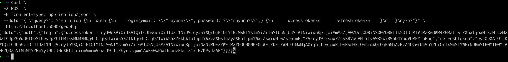

## GraphQL

L'API Mobilic est un service web (basé sur le protocole HTTP) qui utilise le standard [GraphQL](https://graphql.org/). Contrairement aux architectures de type REST où le verbe HTTP et l'URI vont caractériser l'opération, toutes les requêtes à l'API GraphQL partageront le même verbe HTTP `POST` et le même URI.

Cet URI commun dépend de l'environnement :

- > https://api.mobilic.beta.gouv.fr/graphql pour l'environnement de production

- > https://api.mobilic.beta.gouv.fr/graphql pour l'environnement bac à sable

- > https://mobilic-api-staging.herokuapp.com/graphql pour l'environnement de recette

Le détail de l'opération sera précisé dans le corps JSON de la requête.

## Exemple simple

La plupart des actions réalisables sur l'API nécessitent d'être [authentifié](auth.md).

Pour cet exemple basique, nous allons prendre une opération qui ne requiert pas l'authentification : l'opération de `login`.

Le corps de la requête, au format JSON, doit contenir un champ `query` qui précise l'opération. La valeur de ce champ `query` est pour l'opération `login` :

```
mutation {
    auth {
        login(email: "XXX", password: "YYY") {
            accessToken
    	    refreshToken
  	    }
    }
}
```

Pour soumettre la requête à l'API il est possible d'utiliser :

- le playground pour une expérience interactive. Voir le [guide du playground](playground.md)
- n'importe quelle librairie HTTP (`curl`, `requests` en `python`, ...)

### Via cURL

Il suffit de constituer le corps JSON de la requête à partir du champ `query`.

```bash
curl \
  -X POST \
  -H "Content-Type: application/json" \
  --data " \
 { \
   \"query\": \"mutation { \
    auth { \
        login(email: \\\"<EMAIL>\\\", password: \\\"<MOT DE PASSE>\\\") { \
            accessToken \
    	    refreshToken \
  	    } \
    } \
   }\" \
 } \
" https://mobilic-api-staging.herokuapp.com/graphql
```



Pour plus d'informations sur la manière d'écrire des opérations GraphQL vous pouvez consulter notre [guide sur les opérations GraphQL](graphql.md)
