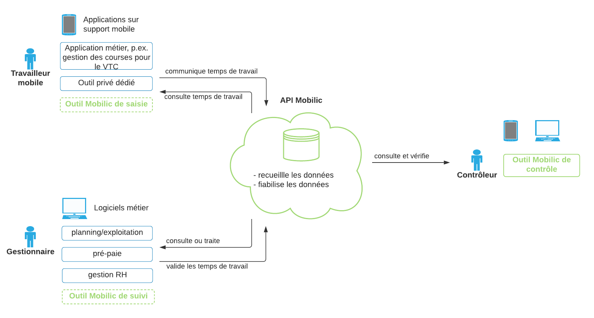

Mobilic est un outil numérique qui a pour but de simplifier et d'améliorer le suivi du temps de travail dans le transport routier. Le coeur de Mobilic est une API qui permet aux applications métier de transmettre et de lire simplement les données relatives au temps de travail. La présente documentation détaille les grands principes ainsi que le fonctionnement de cette API.

## Architecture globale

L'API Mobilic est vouée à être utilisée par 3 types d'acteurs :

- les applications métier des travailleurs mobiles, plutôt sur support mobile ou embarqué, qui vont alimenter l'API en données
- les applications métier des exploitants des entreprises de transport, susceptibles de consommer la donnée à différentes fins (pré-paie, gestion RH, analyse des coûts, ...)
- les outils numériques des corps de contrôle, qui vont se servir des données comme base de contrôle

