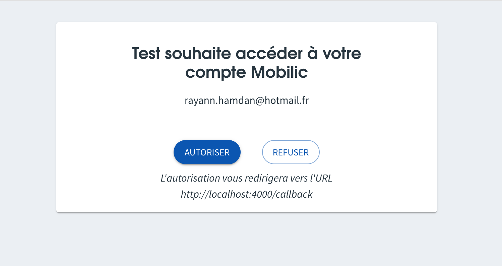

Le [protocole OAuth2](https://oauth.net/2/) permet à des applications métier (`client`) utilisées par les entreprises de transport d'effectuer des opérations sur l'API Mobilic (`resource server`) pour le compte de leurs utilisateurs (`resource owner`)

Plus concrètement la mécanique OAuth permet à l'application métier de récupérer des [jetons d'accès](auth.md) pour le compte d'utilisateurs sans avoir à connaitre leur mot de passe.

> ⚠️ Cette page constitue un guide d'utilisation de l'implémentation faite par Mobilic du protocole OAuth, elle n'a pas vocation à couvrir pas tous les détails du protocole lui-même. Il existe déjà bon nombre de sources bien faites sur le protocole, accessibles en ligne.

## Pré-requis

Le `client` qui souhaite utiliser le protocole OAuth afin d'effectuer des opérations pour le compte de ses utilisateurs doit préalablement enregistrer son application auprès de l'API Mobilic.

Pour cela il faut envoyer un email à l'adresse mobilic@beta.gouv.fr en précisant les informations suivantes :

- environnement demandé (production ou bac à sable)
- nom de l'application
- liste d'URLS de redirection.

Le client recevra alors un `client_id` et un `client_secret` qui lui permettront d'utiliser le module OAuth2.

## Protocole

Il existe plusieurs protocoles OAuth pour permettre au `client` de récupérer un jeton d'accès.

Mobilic implémente le "Authorization Code Grant", détaillé [ici](https://tools.ietf.org/html/rfc6749#section-4.1) et dont voici le schéma :

```
     +----------+
     | Resource |
     |   Owner  |
     |          |
     +----------+
          ^
          |
         (B)
     +----|-----+          Client Identifier      +---------------+
     |         -+----(A)-- & Redirection URI ---->|               |
     |  User-   |                                 | Authorization |
     |  Agent  -+----(B)-- User authenticates --->|     Server    |
     |          |                                 |               |
     |         -+----(C)-- Authorization Code ---<|               |
     +-|----|---+                                 +---------------+
       |    |                                         ^      v
      (A)  (C)                                        |      |
       |    |                                         |      |
       ^    v                                         |      |
     +---------+                                      |      |
     |         |>---(D)-- Authorization Code ---------'      |
     |  Client |          & Redirection URI                  |
     |         |                                             |
     |         |<---(E)----- Access Token -------------------'
     +---------+       (w/ Optional Refresh Token)

   Note: The lines illustrating steps (A), (B), and (C) are broken into
   two parts as they pass through the user-agent.

                     Figure 3: Authorization Code Flow


```

> les deux points d'entrée exposés par Mobilic sont
>
> - pour l'environnement de production
>   - URL d'autorisation : https://mobilic.beta.gouv.fr/oauth/authorize
>   - URL de token : https://mobilic.beta.gouv.fr/api/oauth/token
> - pour l'environnement bac à sable
>   - URL d'autorisation : https://sandbox.mobilic.beta.gouv.fr/oauth/authorize
>   - URL de token : https://sandbox.mobilic.beta.gouv.fr/api/oauth/token

#### A. Redirection de l'utilisateur vers l'URL d'autorisation Mobilic.

Le `client` démarre la procédure en redirigeant le navigateur de l'utilisateur (ou en ouvrant un navigateur si l'application cliente n'est pas une application web) vers l'URL d'autorisation de Mobilic.

La query string de l'URL doit contenir les éléments suivants (cf https://tools.ietf.org/html/rfc6749#section-4.1.1) :

- `client_id` : l'identifiant du client auprès de l'API Mobilic
- `response_type` : la valeur `code`.
- `redirect_uri` : l'URL de redirection souhaité.

Exemple : `https://mobilic.beta.gouv.fr/oauth/authorize?response_type=code&client_id=XXX&redirect_uri=http%3A%2F%2Fclient%2Eexample%2Ecom%2Fcallback`

#### B. Authentification de l'utilisateur et consentement explicite

Mobilic redirige l'utilisateur vers la page d'authentification (s'il n'est pas authentifié) puis vers la page de consentement.

L'utilisateur (`resource owner`) a le choix d'accepter ou de rejeter la demande d'accès du `client` :



#### C. Redirection vers l'application cliente avec un code d'autorisation

Dans le cas où l'utilisateur a donné accès le navigateur est redirigé vers l'URL de redirection spécifié dans la requête d'autorisation.

L'URL de redirection contiendra dans sa query string un code d'autorisation d'une validité de 5 minutes.

Exemple : `https://client.example.com/callback?code=XXX`.

#### D. Demande d'un jeton d'accès en échange du code d'autorisation

Le `client` demande un jeton d'accès en effectuant une requête `POST` sur l'URL de token.

La requête doit contenir les arguments suivants, au format `application/x-www-form-urlencoded` :

- `grant_type=authorization_code`
- `code`, le code d'autorisation
- `redirect_uri`, l'URL de redirection tel qu'il avait été passé dans la requête d'autorisation

La requête doit également être authentifiée avec les identifiants du client, de deux manières possibles :

- ajout du `client_id` et du `client_secret` en arguments supplémentaires de la requête `POST`
- ajout du `client_id` et du `client_secret` dans l'en-tête de la requête par la [méthode basique](https://fr.wikipedia.org/wiki/Authentification_HTTP#M%C3%A9thode_%C2%AB_Basic_%C2%BB).

Exemple :

```http request
POST api/oauth/token HTTP/1.1
Host: mobilic.beta.gouv.fr
Authorization: Basic XXX
Content-Type: application/x-www-form-urlencoded

grant_type=authorization_code&code=YYY
&redirect_uri=https://client.example.com/callback
```

#### E. Récupération du jeton d'accès

Si la requête `POST` à l'URL de token est valide la réponse contiendra un jeton d'accès.
