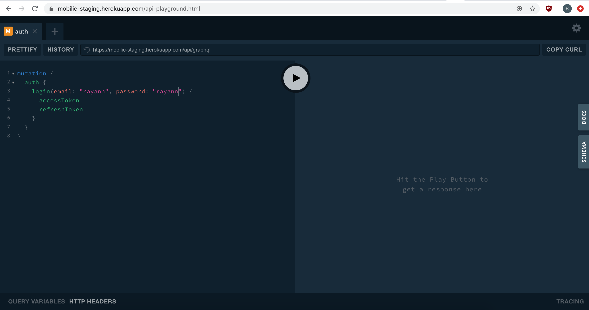
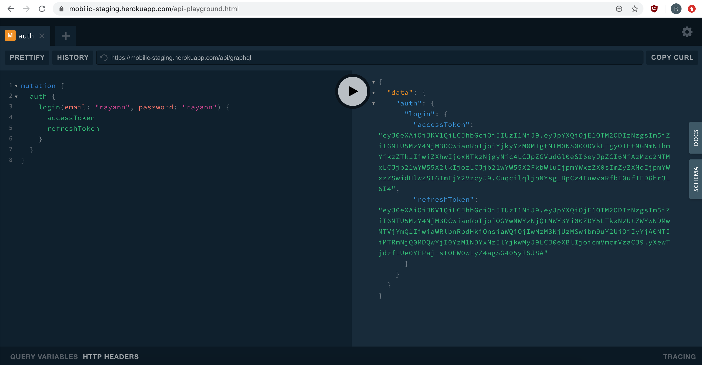

Le playground est une interface graphique simple mais efficace pour découvrir et requêter l'API.

Il est accessible depuis le lien suivant :

> https://mobilic.beta.gouv.fr/developers/playground

## Présentation

Le playground est constitué de 4 parties :

- l'éditeur de requêtes qui occupe l'essentiel de la partie gauche. C'est ici que sont écrites les [opérations](graphql.md).
- les réponses retournées par l'API sur la moitié droite
- le tiroir de documentation qui détaille les actions de l'API, ouvrable depuis le bouton situé tout à droite
- l'éditeur d'en-têtes de requêtes + variables d'opération situé en bas à gauche


## Authentification

La plupart des requêtes à l'API nécessitent d'être [authentifié via un jeton d'accès](auth.md).

Pour ajouter un jeton d'accès obtenu par authentification aux en-têtes d'une requête il suffit d'ajouter la ligne suivante dans l'éditeur correspondant (en bas à gauche), comme montré sur la capture d'écran précédente :

```
{
  "Authorization": "Bearer <jeton d'accès>"
}
```

## Exemple simple

Reprenons l'exemple de l'action de `login` détaillé [ici](how-to.md).

Dans l'éditeur de requêtes il n'y a pas besoin de constituer le corps JSON de la requête HTTP, il suffit simplement d'y écrire l'[opération GraphQL](graphql.md).

.

Puis il suffit de soumettre la requête en cliquant sur le bouton du milieu.

.

## Editer les variables d'opération

Il est possible d'utiliser des [variables d'opération](graphql.md) à l'aide de l'éditeur de variables en bas à gauche, comme ceci :


