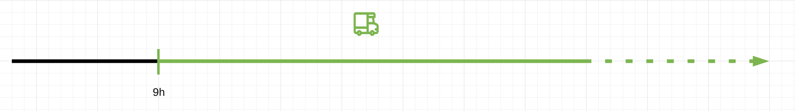
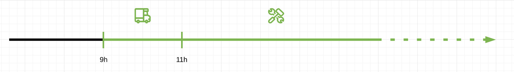
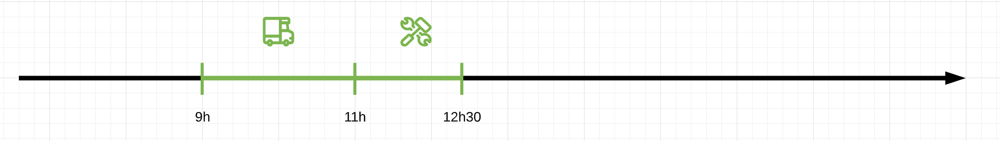
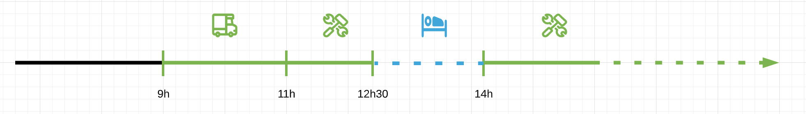
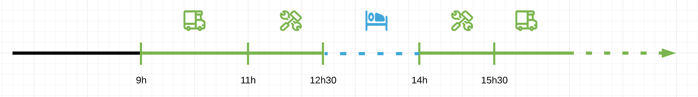
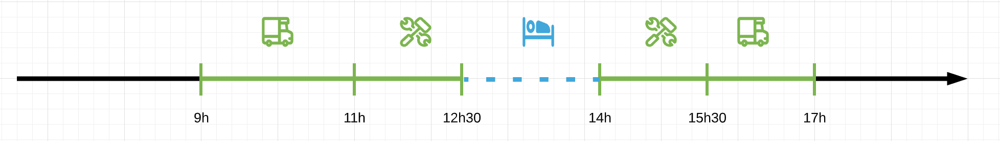
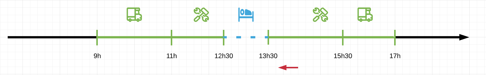
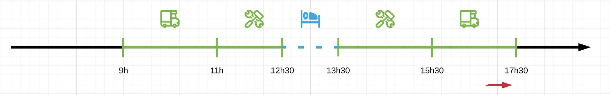
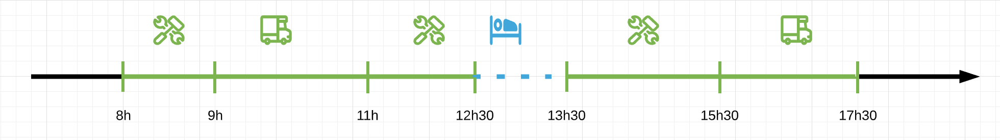

L'enregistrement des activités constitue le principal flux entrant de données de l'API Mobilic.

Nous allons détailler ici les différentes opérations qui permettent de réaliser ces enregistrements.

> Toutes les opérations explicitées ci-après nécessitent une authentification

## Opérations

### Création d'une nouvelle mission

Avant d'enregistrer les activités il est indispensable de créer une mission à laquelle seront rattachées les activités.

L'opération de création de la mission est la suivante :

```gql
mutation {
    activities {
        createMission(name: "XXX", "companyId: YYY) {
            id
            name
        }
    }
}
```

Il y a deux variables, optionnelles toutes les deux :

- `name`
- `companyId`, qui permet de préciser l'entreprise associée à la mission dans le cas où l'auteur est rattaché à plusieurs entreprises.

> Si une entreprise est donnée via `companyId` il faut que l'auteur y soit rattaché, soit en tant que gestionnaire soit en tant que travailleur. Dans le cas où aucune entreprise n'est précisée la mission est associée à l'entreprise de rattachement principale de l'auteur.

La création de la mission ne déclenche pas le démarrage du chrono de temps de travail : les deux moments sont séparés. Cela permet par exemple à l'exploitant de planifier et de créer à l'avance les missions dans son logiciel métier, qui pourrait ensuite les enregistrer dans l'interface dédiée aux travailleurs mobiles pour leur permettre de renseigner le temps de travail de chaque mission le moment venu.

### Enregistrement d'une activité

L'enegistrement d'une activité se fait au moyen de l'opération `logActivity`.

C'est l'opération principale.

```gql
mutation(
  $type: ActivityTypeEnum!
  $startTime: TimeStamp!
  $endTime: TimeStamp
  $switch: Boolean
  $userId: Int
  $context: GenericScalar
  $missionId: Int!
) {
  activities {
    logActivity(
      type: $type
      startTime: $startTime
      missionId: $missionId
      endTime: $endTime
      switch: $switch
      context: $context
      userId: $userId
    ) {
      id
      type
      startTime
    }
  }
}
```

Elle prend en arguments :

- `type`, la nature de la nouvelle activité (déplacement, travail, accompagnement)
- `startTime`, l'heure de début d'activité
- `missionId`, la mission pour laquelle est effectuée l'activité
- `endTime`, l'heure de fin d'activité (optionnelle)
- `switch`, indique si le mode d'enregistrement tachygraphe est activé (optionnel, par défaut oui)
- `userId`, le travailleur mobile pour lequel enregistrer l'activité (optionnel, par défaut c'est l'utilisateur authentifié)
- `context`, des données libres qui seront rattachées à l'activité

> Par défaut l'activité est enregistrée pour l'utilisateur qui effectue l'opération (l'utilisateur authentifié avec le jeton). Afin de faciliter l'usage de l'API il est possible d'enregistrer des activités pour un autre utilisateur, en utilisant le champ `userId`.

#### Mode d'enregistrement tachygraphe

L'API Mobilic privilègie une saisie en temps réel des activités, dans laquelle les évènements de changement d'activité sont transmis à l'API. L'heure de fin d'une activité n'est déterminée qu'au moment du changement d'activité suivant.

En conséquence l'opération `logActivity` a deux modes de fonctionnement :

- le mode "tachygraphe", correspondant au principe ci-dessus (`switch: true`). L'API enregistre les **changements d'activité**.
- un mode plus classique où les activités sont saisies a posteriori avec leur heure de fin éventuelle (`switch: false`). L'API enregistre directement **les activités**.

Plus précisément le mode "tachygraphe" fonctionne de la manière suivante :

- la variable `startTime` correspond à l'heure de changement d'activité. Au moment de l'opération l'utilisateur ne peut pas avoir d'activité enregistrée après cette heure. En d'autres termes le changement d'activité n'est possible que **pendant ou après la dernière activité**.
- l'opération **n'accepte pas d'heure de fin** (`endTime`)
- si la dernière activité de l'utilisateur n'est pas terminée **l'opération met fin à la dernière activité à l'heure** `startTime`.
- l'opération crée une **nouvelle activité démarrant à** `startTime` **et sans date de fin**.

Par opposition le mode d'enregistrement classique se contente de créer une nouvelle période d'activité pour l'utilisateur, en vérifiant simplement qu'il n'y a pas de chevauchement avec son historique. Il peut notamment être utilisé pour intercaler une nouvelle activité parmi les activités passées (ce que le mode tachygraphe ne permet pas de faire).

### Mise à jour d'une activité

L'opération de correction ou de modification d'une activité est `editActivity`. Seule la période d'une activité est modifiable (pas le type de travail, ni la mission ni le travailleur concernés)

```gql
mutation(
  $activityId: Int!
  $startTime: TimeStamp
  $endTime: TimeStamp
  $removeEndTime: Boolean
  $context
) {
  activities {
    editActivity(
      activityId: $activityId
      startTime: $startTime
      endTime: $endTime
      removeEndTime: $removeEndTime
      context: $context
    ) {
      id
      type
      startTime
    }
  }
}
```

Elle prend en arguments :

- `activityId`, l'identifiant de l'activité à modifier
- `startTime`, la nouvelle heure de début (optionnelle, si elle a été modifiée)
- `endTime`, la nouvelle heure de fin (optionnelle, si elle a été modifiée)
- `removeEndTime`, indique si la fin de l'activité doit être annulée (optionnel et incompatible avec `endTime`). Utile si l'activité a été terminée par erreur.
- `context`, des données libres qui seront rattachées à l'évènement de modification.

### Annulation d'une activité

L'opération d'annulation d'une activité est `cancelActivity`. Elle permet de supprimer l'activité de l'historique de l'utilisateur.

```gql
mutation(
  $activityId: Int!
  $context
) {
  activities {
    cancelActivity(
      activityId: $activityId
      context: $context
    ) {
       success
    }
  }
}
```

### Fin de mission

L'opération signale la fin de la mission pour le travailleur mobile.

```gql
mutation(
  $missionId: Int!
  $endTime: TimeStamp!
  $userId: Int
  $context: GenericScalar
) {
  activities {
    endMission(
      missionId: $missionId
      endTime: $endTime
      userId: $userId
      context: $context
    ) {
      id
      name
    }
  }
}
```

Les arguments de l'opération ont la même fonction que pour l'enregistrement d'une activité. Dans le cas où la dernière activité de l'utilisateur n'est pas terminée l'opération y met fin à l'heure `endTime`.

## Exemples

Nous allons illustrer l'utilisation et le rôle des opérations précédentes à travers l'exemple d'une journée de travail classique.

### Début de journée

La première action à effectuer consiste à créer une mission.

```gql
mutation {
  activities {
    createMission(name: "Journée test", companyId: 1) {
      id
      name
    }
  }
}
```

Réponse

```json
{
  "data": {
    "activities": {
      "createMission": {
        "id": 18,
        "name": "Journée test"
      }
    }
  }
}
```

#### Première activité

On peut ensuite enregistrer le démarrage de la première activité de la mission.

```gql
mutation {
  activities {
    # 9h00
    logActivity(missionId: 18, type: "drive", startTime: 1577869200) {
      id
      type
      startTime
      endTime
    }
  }
}
```

Réponse

```json
{
  "data": {
    "activities": {
      "logActivity": {
        "id": 193,
        "type": "drive",
        "startTime": 1577869200,
        "endTime": null
      }
    }
  }
}
```



En mode tachygraphe l'activité n'a pas d'heure de fin au moment de son enregistrement. Tant que l'API ne reçoit pas un nouvel évènement de changement ou de fin d'activité le chronomètre continue de tourner.

#### Deuxième activité

L'enregistrement du changement d'activité se fait de manière identique à l'enregistrement précédent, c'est-à-dire en mode tachygraphe.

```gql
mutation {
  activities {
    # 11h00
    logActivity(missionId: 18, type: "work", startTime: 1577876400) {
      id
      type
      startTime
      endTime
    }
  }
}
```

Réponse

```json
{
  "data": {
    "activities": {
      "logActivity": {
        "id": 194,
        "type": "work",
        "startTime": 1577876400,
        "endTime": null
      }
    }
  }
}
```



Le changement d'activité a créé une nouvelle activité débutant à 11h (et sans heure de fin) et a mis fin à l'activité précédente à cette même heure.

### Pause

Pour indiquer la fin d'une activité sans démarrage immédiat d'une autre activité, il suffit d'éditer la date de fin de l'activité.

```gql
mutation {
  activities {
    # 12h30
    editActivity(activityId: 194, endTime: 1577881800) {
      id
      type
      startTime
      endTime
    }
  }
}
```

Réponse

```json
{
  "data": {
    "activities": {
      "editActivity": {
        "id": 194,
        "type": "work",
        "startTime": 1577876400,
        "endTime": 1577881800
      }
    }
  }
}
```



### Fin de journée

#### Troisième activité

Une fois la pause terminée l'enregistrement des activités peut reprendre, toujours en mode tachygraphe.

```gql
mutation {
  activities {
    # 14h00
    logActivity(missionId: 18, type: "work", startTime: 1577887200) {
      id
      type
      startTime
      endTime
    }
  }
}
```

Réponse

```json
{
  "data": {
    "activities": {
      "logActivity": {
        "id": 195,
        "type": "work",
        "startTime": 1577887200,
        "endTime": null
      }
    }
  }
}
```



Lors du décompte du temps de travail sur la journée, les périodes de creux entre deux activités seront automatiquement décomptées comme du temps de pause.

#### Quatrième activité

```gql
mutation {
  activities {
    # 15h30
    logActivity(missionId: 18, type: "drive", startTime: 1577892600) {
      id
      type
      startTime
      endTime
    }
  }
}
```

Réponse

```json
{
  "data": {
    "activities": {
      "logActivity": {
        "id": 196,
        "type": "drive",
        "startTime": 1577892600,
        "endTime": null
      }
    }
  }
}
```



#### Fin de mission

Pour terminer la mission il suffit d'effectuer l'opération `endMission` en passant la date de fin de l'activité en cours.

```gql
mutation {
  activities {
    # 17h
    endMission(missionId: 18, endTime: 1577898000) {
      id
    }
  }
}
```

Réponse

```json
{
  "data": {
    "activities": {
      "endMission": {
        "id": 18
      }
    }
  }
}
```



### Corrections éventuelles

Le travailleur mobile s'aperçoit de quelques erreurs et oublis dans sa saisie intiale.

#### Oubli de redémarrer après la pause

La vraie heure de reprise d'activité après la pause du midi est 13h30 mais l'utilisateur n'a enregistré la reprise qu'à 14h. Pour corriger cela il lui suffit d'indiquer que l'activité de reprise a en fait démarré une demi-heure plus tôt.

```gql
mutation {
  activities {
    # 13h30
    editActivity(activityId: 195, startTime: 1577885400) {
      id
      type
      startTime
      endTime
    }
  }
}
```

Réponse

```json
{
  "data": {
    "activities": {
      "editActivity": {
        "id": 195,
        "type": "work",
        "startTime": 1577885400,
        "endTime": 1577892600
      }
    }
  }
}
```



#### Correction de la fin d'une activité

Le travailleur mobile a signalé trop tôt la fin de mission. Il souhaite décaler la date de fin de 17h à 17h30.

```gql
mutation {
  activities {
    # 17h30
    editActivity(activityId: 196, endTime: 1577899800) {
      id
      type
      startTime
      endTime
    }
  }
}
```

Réponse

```json
{
  "data": {
    "activities": {
      "editActivity": {
        "id": 196,
        "type": "work",
        "startTime": 1577892600,
        "endTime": 1577899800
      }
    }
  }
}
```



#### Rajout d'une activité a posteriori

Le travailleur mobile souhaite ajouter une activité qui s'est déroulée de 8h à 9h. Il lui suffit d'enregistrer une activité en mode classique.

```gql
mutation {
  activities {
    # 8h - 9h
    logActivity(
      missionId: 18
      type: "work"
      startTime: 1577865600
      endTime: 1577869200
      switch: false
    ) {
      id
      type
      startTime
      endTime
    }
  }
}
```

Réponse

```json
{
  "data": {
    "activities": {
      "logActivity": {
        "id": 197,
        "type": "work",
        "startTime": 1577865600,
        "endTime": 1577869200
      }
    }
  }
}
```


